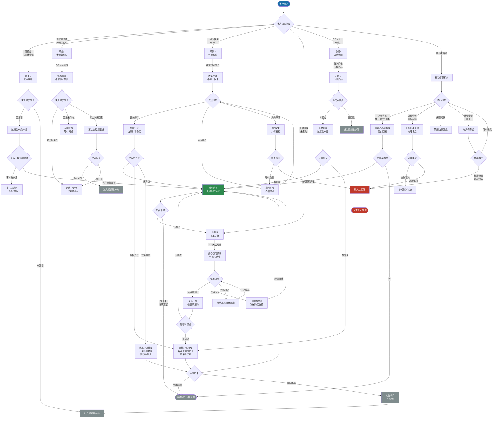

```mermaid
flowchart TD
    START([客户进入]) --> CLASSIFY{客户类型判断}

    %% ─────────── 场景分流 ───────────
    CLASSIFY -->|新接触\n未领体验装| S5_BREAK[场景5\n破冰欢迎]
    CLASSIFY -->|领取体验装\n未确认使用| S1_TRIAL[场景1\n体验装跟进]
    CLASSIFY -->|已确认使用\n未下单| S2_FEEDBACK[场景2\n体验回访]
    CLASSIFY -->|首单完成\n未复购| S3_REBUY[场景3\n首单关怀]
    CLASSIFY -->|3个月以上\n未购买| S4_DORMANT[场景4\n沉默唤回]
    CLASSIFY -->|主动来咨询| PASSIVE[被动客服模式]

    %% ─────────── 场景5：新客破冰 ───────────
    S5_BREAK --> S5_REPLY{客户是否回复}
    S5_REPLY -->|回复了| S5_PRODUCT[过渡到产品介绍]
    S5_REPLY -->|未回复| S5_POOL[进入低频维护池]
    S5_PRODUCT --> S5_TRIAL_Q{是否引导领体验装}
    S5_TRIAL_Q -->|客户有兴趣| S5_SENT[寄出体验装\n→ 切换场景1]
    S5_TRIAL_Q -->|客户直接要买| PURCHASE[引导购买]

    %% ─────────── 场景1：体验装跟进 ───────────
    S1_TRIAL -->|3-5天后触达| S1_REMIND[温和提醒\n不催促不施压]
    S1_REMIND --> S1_REPLY{客户是否回复}
    S1_REPLY -->|回复说用了| S1_USED[确认已使用\n→ 切换场景2]
    S1_REPLY -->|回复未用/忙| S1_WAIT[表示理解\n等待时机]
    S1_REPLY -->|第二次无回复| S1_F2[第二次轻量跟进]
    S1_F2 --> S1_REPLY2{是否回复}
    S1_REPLY2 -->|仍无回复| S1_POOL[进入低频维护池]
    S1_REPLY2 -->|有回复| S1_USED

    %% ─────────── 场景2：体验回访 ───────────
    S2_FEEDBACK -->|触达询问感受| S2_ASK[收集反馈\n不急于促单]
    S2_ASK --> S2_RESULT{反馈类型}
    S2_RESULT -->|正向好评| S2_POS[承接好评\n自然引导购买]
    S2_RESULT -->|中性还行| S2_NEU[追问细节\n挖掘顾虑]
    S2_RESULT -->|负向不满| S2_NEG[挽回处理\n共情安抚]
    S2_POS --> S2_OBJ{是否有异议}
    S2_OBJ -->|无异议| PURCHASE
    S2_OBJ -->|价格异议| OBJ_PRICE[价格异议处理]
    S2_OBJ -->|效果疑虑| OBJ_EFFECT[效果异议处理]
    S2_NEU --> S2_RESULT
    S2_NEG --> S2_NEG2{能否挽回}
    S2_NEG2 -->|可以挽回| S2_NEU
    S2_NEG2 -->|问题较严重| HUMAN[转人工客服]

    %% ─────────── 场景3：首单关怀 ───────────
    S3_REBUY -->|7-14天后触达| S3_CARE[关心使用情况\n体现人情味]
    S3_CARE --> S3_REPLY{使用进度}
    S3_REPLY -->|使用体验好| S3_POS[承接正向\n轻引导复购]
    S3_REPLY -->|快用完了| S3_READY[复购意向高\n发送购买链接]
    S3_REPLY -->|还有很多| S3_TRACK[继续追踪消耗进度]
    S3_POS --> S3_OBJ{是否有顾虑}
    S3_OBJ -->|无顾虑| PURCHASE
    S3_OBJ -->|有异议| OBJ_PRICE
    S3_READY --> PURCHASE
    S3_TRACK -->|下次触达| S3_REPLY

    %% ─────────── 场景4：沉默唤回 ───────────
    S4_DORMANT -->|首次问候\n不提产品| S4_GREET[先聊人\n不聊产品]
    S4_GREET --> S4_REPLY{是否有回应}
    S4_REPLY -->|有回应| S4_INTEREST[重燃兴趣\n过渡到产品]
    S4_REPLY -->|无回应| S4_POOL[进入低频维护池]
    S4_INTEREST --> S4_OBJ{反应如何}
    S4_OBJ -->|有兴趣| PURCHASE
    S4_OBJ -->|有异议| OBJ_PRICE

    %% ─────────── 被动客服模式 ───────────
    PASSIVE --> PASSIVE_INTENT{咨询类型}
    PASSIVE_INTENT -->|产品咨询\n成分/功效/价格| KB[查询产品知识库\n如实回答]
    PASSIVE_INTENT -->|订单物流\n售后问题| ORDER[查询订单系统\n处理售后]
    PASSIVE_INTENT -->|闲聊问候| CHAT[简短自然回应]
    KB --> PASSIVE_BUY{有购买意向}
    PASSIVE_BUY -->|是| PURCHASE
    PASSIVE_BUY -->|否| WAIT_END([等待客户下次咨询])
    ORDER --> ORDER_TYPE{问题类型}
    ORDER_TYPE -->|查询物流| TRACK_ORDER[告知物流状态]
    ORDER_TYPE -->|退款退货| HUMAN

    %% ─────────── 通用：异议处理 ───────────
    OBJ_PRICE[价格异议处理\n客观说明性价比\n不编造优惠] --> OBJ_RESULT{处理结果}
    OBJ_EFFECT[效果异议处理\n引用检测数据\n建议先试用] --> OBJ_RESULT
    OBJ_RESULT -->|顾虑消除| PURCHASE
    OBJ_RESULT -->|仍有顾虑| WAIT_END
    OBJ_RESULT -->|明确拒绝| CLOSING[礼貌收口\n不纠缠]

    %% ─────────── 通用：促单与结束 ───────────
    PURCHASE[引导购买\n发送购买链接] --> DONE{是否下单}
    DONE -->|下单了| S3_REBUY
    DONE -->|未下单\n继续观望| WAIT_END

    CLOSING --> S5_POOL
    HUMAN --> HUMAN_END([人工介入处理])

    %% ─────────── 特殊拦截 ───────────
    PASSIVE_INTENT -->|情绪激动\n投诉| EMOTION[先共情安抚]
    EMOTION --> EMOTION_TYPE{情绪类型}
    EMOTION_TYPE -->|可以安抚| PASSIVE_INTENT
    EMOTION_TYPE -->|极度愤怒\n退款投诉| HUMAN

    %% ─────────── 样式 ───────────
    style PURCHASE fill:#2d8a4e,color:#fff
    style HUMAN fill:#c0392b,color:#fff
    style HUMAN_END fill:#c0392b,color:#fff
    style CLOSING fill:#7f8c8d,color:#fff
    style S5_POOL fill:#7f8c8d,color:#fff
    style S1_POOL fill:#7f8c8d,color:#fff
    style S4_POOL fill:#7f8c8d,color:#fff
    style WAIT_END fill:#7f8c8d,color:#fff
    style START fill:#1a6ea8,color:#fff
```
